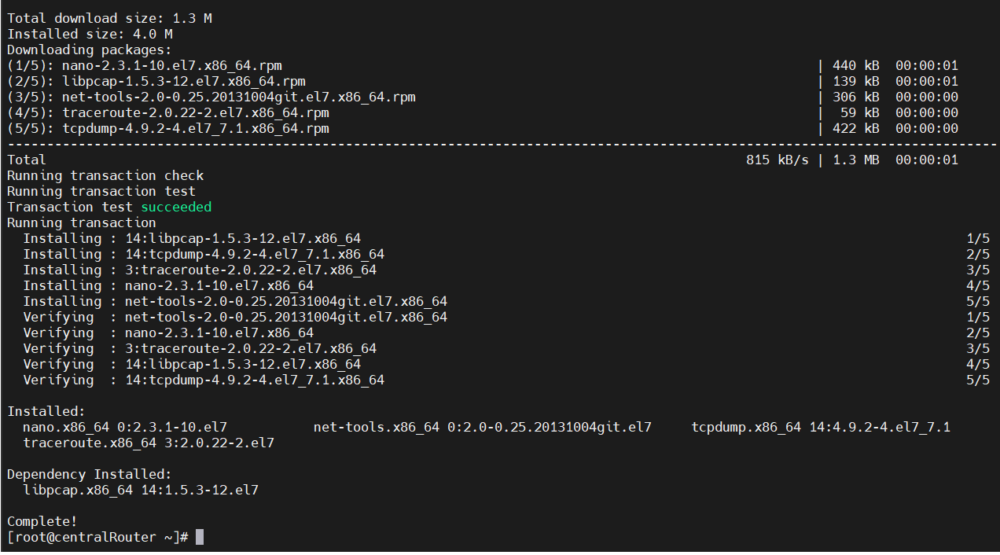
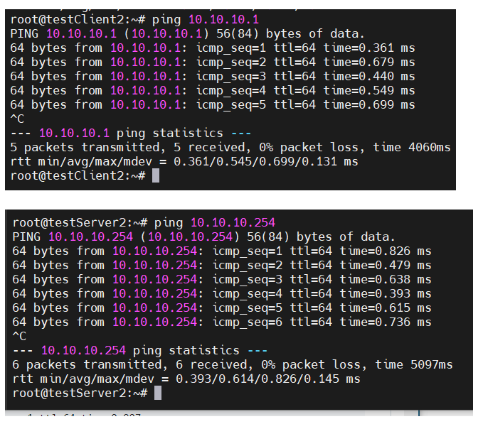
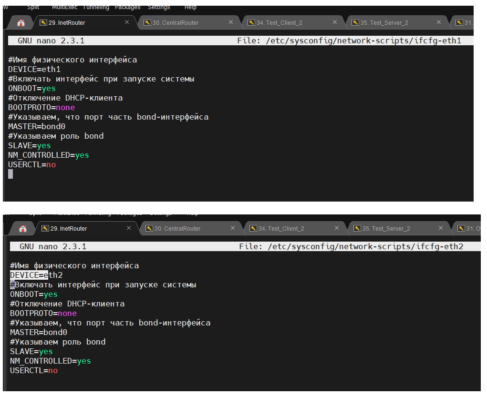

# homework-VLAN и LACP

Описание домашнего задания
---
в Office1 в тестовой подсети появляются сервера с доп интерфейсами и адресами
в internal сети testLAN: 
- testClient1 - 10.10.10.254
- testClient2 - 10.10.10.254
- testServer1- 10.10.10.1 
- testServer2- 10.10.10.1

Равести вланами:
testClient1 <-> testServer1
testClient2 <-> testServer2

Между centralRouter и inetRouter "пробросить" 2 линка (общая inernal сеть) и объединить их в бонд, проверить работу c отключением интерфейсов
*Интересненько :D*


---
ОС для настройки: 
- CentOS Linux release 7.9.2009 (Core) (особо сложностей из-за отличий с методичек не увидел)
- Ubuntu 22.04

Vagrant версии 2.4.1

VirtualBox версии 7.0.18

**Примечание** В Vagrantfile были внесены изменения в части урезания ресурсов, выделяемых для VM, по причине "самому мало :D". Учитывая количество хостов в текущем стенде, и мой ноутбук, я просто не прохожу по функциональным требованиям аппаратных ресурсов, опять.. 

После уменьшения памяти и ядер - с ощутимыми лагами, но виртуалки поднялись. Остальное медленно руками.


Планируемая топология сети


---
- Этап 1: Создаем Vagrantfine, запускаем ВМ.

После того, как VM все таки развернулись, создадим\обновим файлы для приведения стенда к работе:

**На всех хостах с ОС Centos:**
1. Меняем репозиторий, потому что из коробки не работает
2. Менял на https://mirror.yandex.ru/centos/centos/7/os/x86_64/
3. Обновляем пакеты, устанавливаем ПО: yum install -y nano traceroute tcpdump net-tools

**На всех хостах с ОС Ubuntu:**
1. Обновляем пакеты
2. Устанавливаем ПО apt install -y traceroute tcpdump net-tools





---
- Этап 2: Настройка VLAN на хостах

**Начнем с RHEL-based систем (Centos)**


Участвуют testClient1 и testServer1

---
**На хосте testClient1**

```bash
#Создаем файл
nano /etc/sysconfig/network-scripts/ifcfg-vlan1

VLAN=yes
#Тип интерфейса - VLAN
TYPE=Vlan
#Указываем физическое устройство, через которые будет работать VLAN
PHYSDEV=eth1
#Указываем номер VLAN (VLAN_ID)
VLAN_ID=1
VLAN_NAME_TYPE=DEV_PLUS_VID_NO_PAD
PROXY_METHOD=none
BROWSER_ONLY=no
BOOTPROTO=none
#Указываем IP-адрес интерфейса
IPADDR=10.10.10.254
#Указываем префикс (маску) подсети
PREFIX=24
#Указываем имя vlan
NAME=vlan1
#Указываем имя подинтерфейса
DEVICE=eth1.1
ONBOOT=yes
```


---
**На хосте testServer1**

```bash
#Создаем файл (отличие от предыдущего конфига в IP адресе
nano /etc/sysconfig/network-scripts/ifcfg-vlan1

VLAN=yes
#Тип интерфейса - VLAN
TYPE=Vlan
#Указываем физическое устройство, через которые будет работать VLAN
PHYSDEV=eth1
#Указываем номер VLAN (VLAN_ID)
VLAN_ID=1
VLAN_NAME_TYPE=DEV_PLUS_VID_NO_PAD
PROXY_METHOD=none
BROWSER_ONLY=no
BOOTPROTO=none
#Указываем IP-адрес интерфейса
IPADDR=10.10.10.1
#Указываем префикс (маску) подсети
PREFIX=24
#Указываем имя vlan
NAME=vlan1
#Указываем имя подинтерфейса
DEVICE=eth1.1
ONBOOT=yes
```


Перезапускаем сеть на **testServer1** и **testClient1**

```bash
systemctl restart NetworkManager
```


---
Проверим настройку интерфейса, если настройка произведена правильно, то с хоста testClient1 будет проходить ping до хоста testServer1


```bash
ip a
ping 10.10.10.1
```


---
**Настройка VLAN на Ubuntu**


Участвуют testClient2 и testServer2

---
**На хосте testClient2**


```bash
#Редактируем файл
nano /etc/netplan/50-cloud-init.yaml


# network: {config: disabled}
network:
    ethernets:
        enp0s3:
            dhcp4: true
            dhcp6: true
            match:
                macaddress: 02:8f:be:f2:49:93
            set-name: enp0s3
        enp0s8: {}
    vlans:
        #Имя VLANа
        vlan2:
            #Указываем номер VLAN`а
            id: 2
            #Имя физического интерфейса
            link: enp0s8
            #Отключение DHCP-клиента
            dhcp4: no
            #Указываем ip-адрес
            addresses: [10.10.10.254/24]

    version: 2
```

---
**На хосте testServer2** Разница только лишь в IP адресе


```bash
#Редактируем файл
nano /etc/netplan/50-cloud-init.yaml


# network: {config: disabled}
network:
    ethernets:
        enp0s3:
            dhcp4: true
            dhcp6: true
            match:
                macaddress: 02:8f:be:f2:49:93
            set-name: enp0s3
        enp0s8: {}
    vlans:
        #Имя VLANа
        vlan2:
            #Указываем номер VLAN`а
            id: 2
            #Имя физического интерфейса
            link: enp0s8
            #Отключение DHCP-клиента
            dhcp4: no
            #Указываем ip-адрес
            addresses: [10.10.10.1/24]

    version: 2
```

---
**Замечание!** 
В текущем конфиге очень важны отступы! 
В общем, правило такое: С каждым новым разделом - отступ 4(четыре) пробела. Для демонстрации и на будущее, привожу правильные и не правильный скрин конфига, а так же скрин с маркерами отступов


**НЕ_правильный конфиг**


**Норимальный конфиг**


**Отступы в конфиге**


**Симптомы проблем:** Допольно неплохо говорится, где ошибки, когда пытаешься применить конфигурацию. Которая, кстати, не применяется.


---
После настройки второго VLAN`а ping должен работать между хостами testClient1, testServer1 и между хостами testClient2, testServer2. Проверим

между хостами testClient2, testServer2




между хостами testClient1, testServer1


---
- Этап 3: Настройка LACP между хостами inetRouter и centralRouter


**Bond интерфейс будет работать через порты eth1 и eth2**


**Работа выполняется на обоих хостах, inetRouter и centralRouter**

---
```bash
#Создаем конфиг для eth1
nano /etc/sysconfig/network-scripts/ifcfg-eth1

#Имя физического интерфейса
DEVICE=eth1
#Включать интерфейс при запуске системы
ONBOOT=yes
#Отключение DHCP-клиента
BOOTPROTO=none
#Указываем, что порт часть bond-интерфейса
MASTER=bond0
#Указываем роль bond
SLAVE=yes
NM_CONTROLLED=yes
USERCTL=no
```

---
```bash
#Создаем конфиг для eth2
nano /etc/sysconfig/network-scripts/ifcfg-eth2

#Имя физического интерфейса
DEVICE=eth2
#Включать интерфейс при запуске системы
ONBOOT=yes
#Отключение DHCP-клиента
BOOTPROTO=none
#Указываем, что порт часть bond-интерфейса
MASTER=bond0
#Указываем роль bond
SLAVE=yes
NM_CONTROLLED=yes
USERCTL=no
```




---
**Настраиваем bond-интерфейс, тоже делается на inetRouter и centralRouter** Разница в конфигах только в IP адресе


---
```bash
#Создаем конфиг
nano /etc/sysconfig/network-scripts/ifcfg-bond0

DEVICE=bond0
NAME=bond0
#Тип интерфейса — bond
TYPE=Bond
BONDING_MASTER=yes
#Указаваем IP-адрес 
IPADDR=192.168.255.1
#Указываем маску подсети
NETMASK=255.255.255.252
ONBOOT=yes
BOOTPROTO=static
#Указываем режим работы bond-интерфейса Active-Backup
# fail_over_mac=1 — данная опция «разрешает отвалиться» одному интерфейсу
BONDING_OPTS="mode=1 miimon=100 fail_over_mac=1"
NM_CONTROLLED=yes
```


---
После создания данных конфигурационных файлов необходимо перезапустить сеть:


```bash
systemctl restart NetworkManager
```


На некоторых версиях RHEL/CentOS перезапуск сетевого интерфейса не запустит bond-интерфейс, в этом случае рекомендуется перезапустить хост.


---
**После настройки агрегации портов, необходимо проверить работу bond-интерфейса**. Для наглядности на скринах показано системное время


**На хосте inetRouter (192.168.255.1) запустим ping до centralRouter (192.168.255.2)**


**Не отменяя ping, на centralRouter выключим интерфейс eth1**


**После данного действия ping не прекращается, так как трафик пойдёт по-другому порту**


